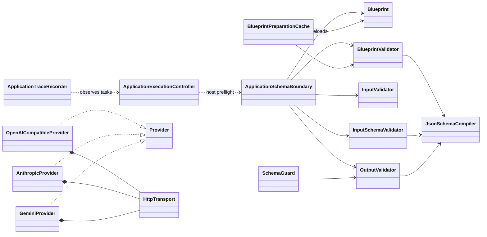

# Blueprint, application, validation, and provider classes

Application helpers validate graph edges, enforce admission policy, and record
value-free traces. They do not become a workflow engine. Host code still owns
sequencing, persistence, authorization, and side effects. Providers compose a
shared HTTP transport for error, timeout, and JSON handling while retaining
provider-specific request and response codecs.

Return to the [PixieCore class diagram index](class-diagrams.md).
