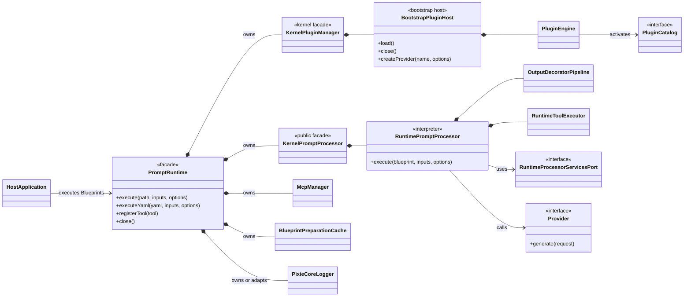
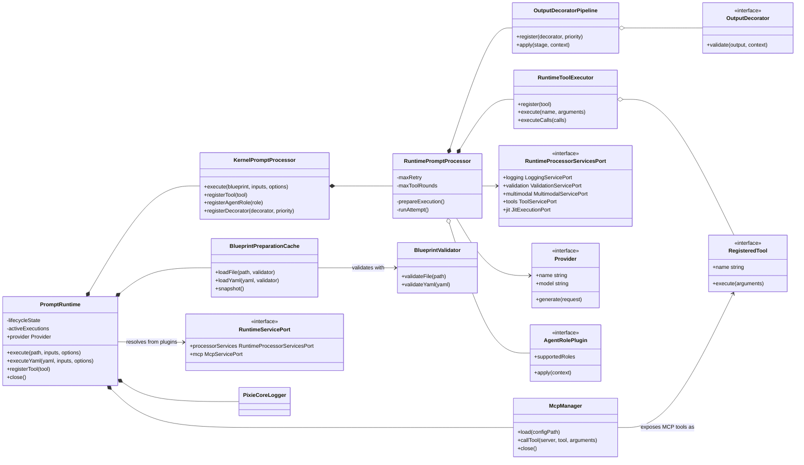
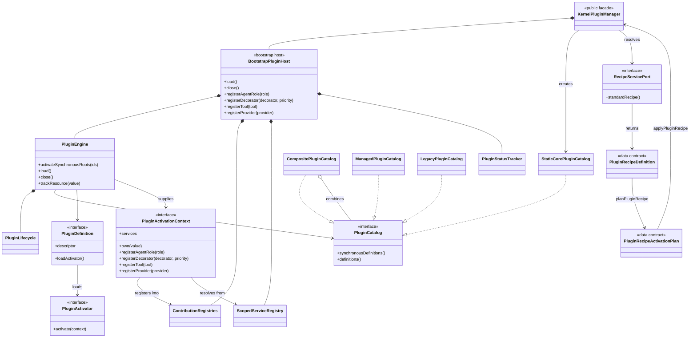

# PixieCore class diagrams

These diagrams describe the current PixieCore 0.1.x implementation. They focus
on ownership, composition, and major runtime dependencies. Method signatures
are intentionally limited to operations that explain each boundary; TypeDoc is
the authoritative API reference for complete signatures.

## 1. Architecture overview

`KernelPluginManager` is the public class exported as `PluginManager` from
`src/core/kernel/plugin/manager.ts`. `BootstrapPluginHost` is the private host
implemented in `src/core/bootstrap/plugin-manager/manager.ts`. The public
facade delegates to that host and never exposes its mutable registries.

## 2. Runtime and processor

The runtime owns lifecycle and resource closure. The processor owns one
Blueprint execution, including bounded provider correction retries and bounded
tool rounds. `RuntimeProcessorServicesPort` keeps validation, logging,
multimodal conversion, tool naming, and optional JIT execution scope-local.

## 3. PluginManager, catalogs, and Recipe

Only `pixiecore.recipe` is activated directly by the public facade. Its locked
Recipe selects the required core roots. `PluginEngine` resolves dependency
order, activates definitions, records status, and transfers cleanup ownership
to `PluginLifecycle`. Managed and legacy catalogs remain behind the same
`PluginCatalog` interface.

## 4. Blueprint, application, validation, and providers

The fourth diagram is maintained as a separate project document so each
TypeDoc page has an isolated Mermaid rendering scope:

- [Blueprint, application, validation, and provider classes](class-diagram-blueprint-application.md)

## Source map

| Diagram name | Implementation |
|---|---|
| `PromptRuntime` | [`src/core/kernel/runtime/index.ts`](../../src/core/kernel/runtime/index.ts) |
| `KernelPluginManager` | [`src/core/kernel/plugin/manager.ts`](../../src/core/kernel/plugin/manager.ts) |
| `BootstrapPluginHost` | [`src/core/bootstrap/plugin-manager/manager.ts`](../../src/core/bootstrap/plugin-manager/manager.ts) |
| `PluginEngine` | [`src/core/bootstrap/plugin-manager/activation/engine.ts`](../../src/core/bootstrap/plugin-manager/activation/engine.ts) |
| Catalog implementations | [`src/core/bootstrap/plugin-manager/catalog/index.ts`](../../src/core/bootstrap/plugin-manager/catalog/index.ts), [`src/core/kernel/plugin/catalog.ts`](../../src/core/kernel/plugin/catalog.ts), and [`src/core/bootstrap/plugin-manager/managed/catalog.ts`](../../src/core/bootstrap/plugin-manager/managed/catalog.ts) |
| `KernelPromptProcessor` | [`src/core/kernel/processor/index.ts`](../../src/core/kernel/processor/index.ts) |
| `RuntimePromptProcessor` | [`src/plugins/runtime/src/processor.ts`](../../src/plugins/runtime/src/processor.ts) |
| `OutputDecoratorPipeline` | [`runtime/decorator-pipeline.ts`](../../src/plugins/runtime/src/decorator-pipeline.ts) |
| `RuntimeToolExecutor` | [`runtime/tool-executor.ts`](../../src/plugins/runtime/src/tool-executor.ts) |
| Application classes | [`application/mapping.ts`](../../src/core/kernel/application/mapping.ts), [`application/graph.ts`](../../src/core/kernel/application/graph.ts), [`application/execution.ts`](../../src/core/kernel/application/execution.ts), [`application/control.ts`](../../src/core/kernel/application/control.ts), and [`application/trace.ts`](../../src/core/kernel/application/trace.ts) |
| Validation classes | [`validation/blueprint.ts`](../../src/plugins/validation/src/schema/blueprint.ts), [`validation/input/index.ts`](../../src/plugins/validation/src/input/index.ts), [`validation/output.ts`](../../src/plugins/validation/src/schema/output.ts), and [`validation/json-schema.ts`](../../src/plugins/validation/src/schema/json-schema.ts) |
| Provider classes | [`providers/shared.ts`](../../src/plugins/providers/src/shared.ts), [`providers/openai-compatible.ts`](../../src/plugins/providers/src/openai-compatible.ts), [`providers/anthropic.ts`](../../src/plugins/providers/plugins/anthropic/src/anthropic/index.ts), and [`providers/gemini.ts`](../../src/plugins/providers/plugins/gemini/src/gemini/index.ts) |
