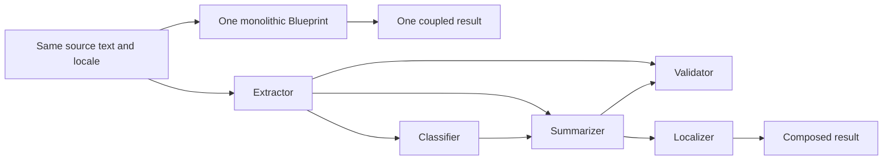

# Monolithic prompt and Blueprint composition comparison

The same publication-brief task can be expressed as one large Blueprint or as
five small Blueprints. PixieCore includes both as executable examples so the
boundary can be inspected rather than argued from prompt size alone.



Both paths perform the same five cognitive operations and return the same
typed result shape. Their structural contracts differ:

| Property | Monolithic | Composed |
|---|---:|---:|
| Blueprint executions | 1 | 5 |
| Independently executable/evaluable units | 1 | 5 |
| Cognitive operations represented | 5 | 5 |
| Failure localization | Whole response | Named node and pinned Blueprint version |
| Replace one operation | Edit/re-evaluate the combined Blueprint | Replace/re-evaluate one node and its affected mappings |

The composed path makes intermediate schemas, explicit mappings, cancellation,
retry ownership, and node traces visible in host code. It also normally makes
more provider calls. The monolithic path has fewer execution boundaries but
couples all five operations to one prompt, output schema, evaluation unit, and
version.

## Run the comparison

The implementation is under
[`examples/comparison/publication-brief`](../../examples/comparison/publication-brief/README.md).
It accepts one input, creates fresh runtime options for each approach, and
returns both results plus the structural measurements above.

```bash
npm run build
PIXIECORE_COMPARISON_SOURCE='Release Orion adds typed exports for operators.' \
PIXIECORE_COMPARISON_LOCALE='en-US' \
npx tsx examples/comparison/publication-brief/compare.ts
```

The offline integration test injects scripted providers and verifies one
monolithic execution versus five composed executions with an identical typed
business result. This is a structural demonstration, not an accuracy or cost
benchmark.

## Adjacent-pattern benchmark

The executable comparison also supports an opt-in repeated benchmark for four
approaches: PixieCore composition, a monolithic prompt, a model-planned agent
graph, and a deterministic code-only pipeline. They share synthetic inputs,
one typed output contract, deterministic assertions, a pinned model,
temperature zero, retry zero, and explicit run limits.

The initial public snapshot includes no prior real-provider benchmark result.
Run the [benchmark methodology](../../examples/comparison/publication-brief/README.md)
with an explicit cost authorization to create release-specific evidence. The
result is evidence for that publication task only. It does not measure
development time, organizational maintainability, or universal superiority.
